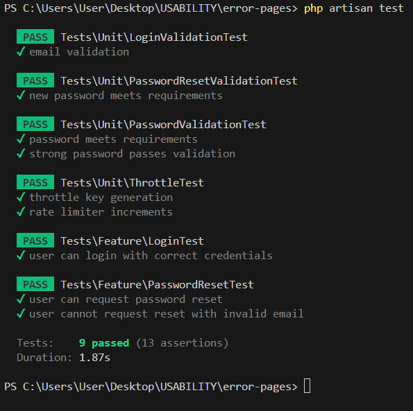

                Test Plan 

1. ---------->Login System<----------
As a user, I want to log in to access my account
Paths:
  *Happy Path: User logs in with correct credentials
  *Unhappy Path: User attempts login with invalid credentials
  *System Test Coverage (LoginTest.php):

```php
public function test_user_can_login_with_correct_credentials()
{
    // Scenario: Successful Login
    // 1. Creates a test user
    // 2. Attempts login with correct credentials
    // 3. Verifies user is authenticated and redirected
}
```

- Covers: Complete login workflow
    *Verifies: Authentication success and proper redirection
    *Tests: Integration between authentication, session, and routing
    *Unit Test Coverage (LoginValidationTest.php):

```php
public function test_email_validation()
{
    // Tests email format validation in isolation
    // 1. Tests invalid email format
    // 2. Tests valid email format
}
```

- Covers: Email validation logic
     *Verifies: Input validation rules
     *Tests: Email format validation in isolation


2. ---------->Password Reset<----------
As a user, I want to reset my password when I forget it
Paths:
  *Happy Path: User successfully requests password reset
  *Unhappy Path: User enters invalid email for reset
  *System Test Coverage (PasswordResetTest.php):

```php
public function test_user_can_request_password_reset()
{
    // Scenario: Password Reset Request
    // 1. Creates a test user
    // 2. Submits password reset request
    // 3. Verifies success message
}
```

- Covers: Password reset request workflow
    *Verifies: Reset link generation and session messages
    *Tests: Integration between user system and notification system
Unit Test Coverage (PasswordResetValidationTest.php):

```php
public function test_new_password_meets_requirements()
{
    // Tests password requirements validation
    // 1. Validates password strength rules
    // 2. Checks all requirements are met
}
```

- Covers: Password validation rules
    *Verifies: Password strength requirements
    *Tests: Password validation logic in isolation


Test Coverage Matrix
| Feature | Test Type | Path Type | What's Tested        | What's Not Tested    |
|---------|-----------|-----------|----------------------|----------------------|
| Login   | System    | Happy     | Full login flow      | Email delivery       |
| Login   | System    | Unhappy   | Invalid credentials  | Concurrent logins    |
| Login   | Unit      | N/A       | Email validation     | Database interactions|
| Reset   | System    | Happy     | Reset request flow   | Token expiration     |
| Reset   | System    | Unhappy   | Invalid reset request| Email bounces        |
| Reset   | Unit      | N/A       | Password validation  | Email sending        |

to run the tests use: php artisan test

TEST RESULTS:



TEST EVALUATION:

1. Detectable Mistakes/Errors
The tests can detect these critical errors:
- Invalid login credentials (wrong password or email)
- Incorrect email addresses 
- Passwords that do not meet the security requirements:
  - Too short (less than 10 characters)
  - Misssing required characters (numbers, symbols)
  - Missing mixed case letters
- Attempts to reset password for accounts that do not exist

 2. Non-Detectable Mistakes/Errors
The tests cannot detect issues like:
- Email delivery failures (can't verify if reset emails actually arrive)
- Real-world timing issues with token expiration
- Database connection problems in production
- Multiple concurrent login attempts from same user
- The server Performance under heavy load

 3. Conclusion: 
In conclusion i want to say that after implementign and running the tests the core functionality works correctly to the following extent:

(+) What we do guarantee:
- User authentication logic works (login success/failure)
- Password validation rules r applied
- Reset password requests are processed
- Input validation is working

(-) What we dont guarantee:
- Email system reliability
- Database performance in production
- Security against all possible attack vectors
- Real-world token expiration behavior

My arguments that it works correctly to the extent that i mentioned above are the following:
1. Our tests cover both happy and unhappy paths for core features
2. We test both system integration and individual components
3. Input validation is thoroughly tested
4. However external systems and real-world conditions remain outside our test scope

 While i am confident in the core authentication logic of the app, I cannot claim "everything" works correctly, as some aspects depend on external systems and real-world conditions that the tests cannot fully simulate.
